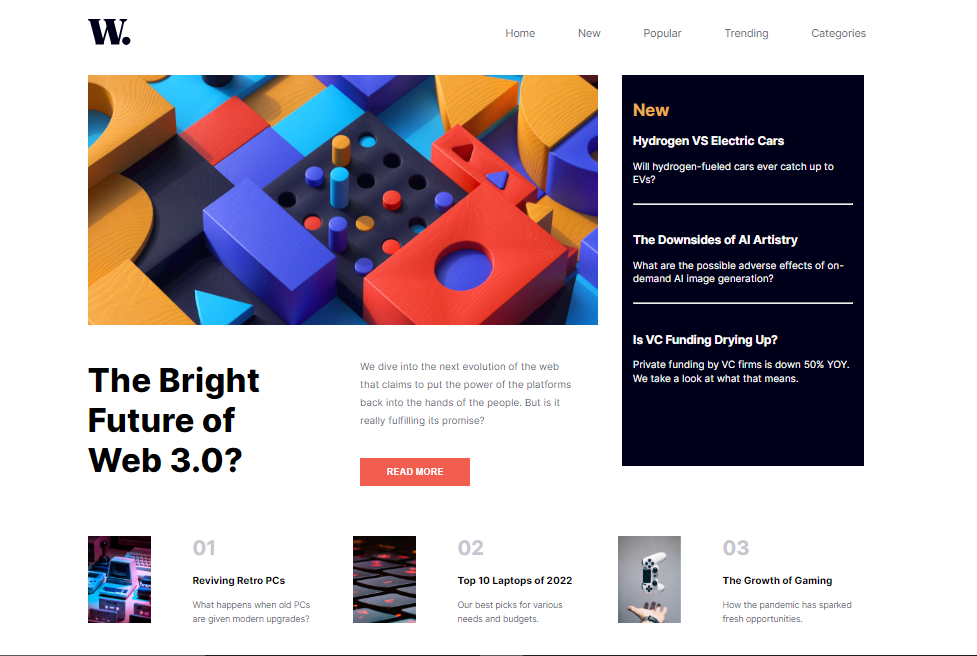

# Frontend Mentor - News homepage solution

This is a solution to the [News homepage challenge on Frontend Mentor](https://www.frontendmentor.io/challenges/news-homepage-H6SWTa1MFl). Frontend Mentor challenges help you improve your coding skills by building realistic projects. 

### Screenshot

 

### Links
- Live Site URL: [preview](https://news-homepage111.netlify.app)

### Built with

- Semantic HTML5 markup
- CSS custom properties
- Flexbox
- CSS Grid
- Mobile-first workflow

## Author
- Frontend Mentor - [@Egbe-Fred](https://www.frontendmentor.io/profile/Egbe-Fred)
